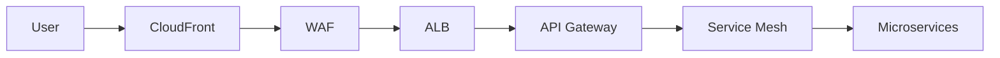
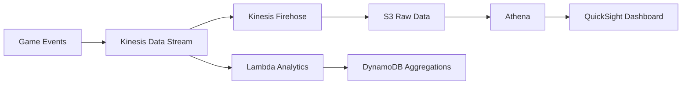
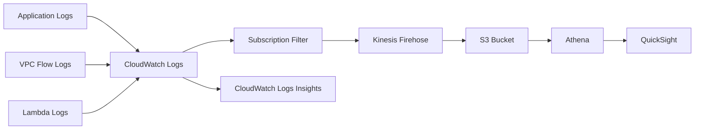
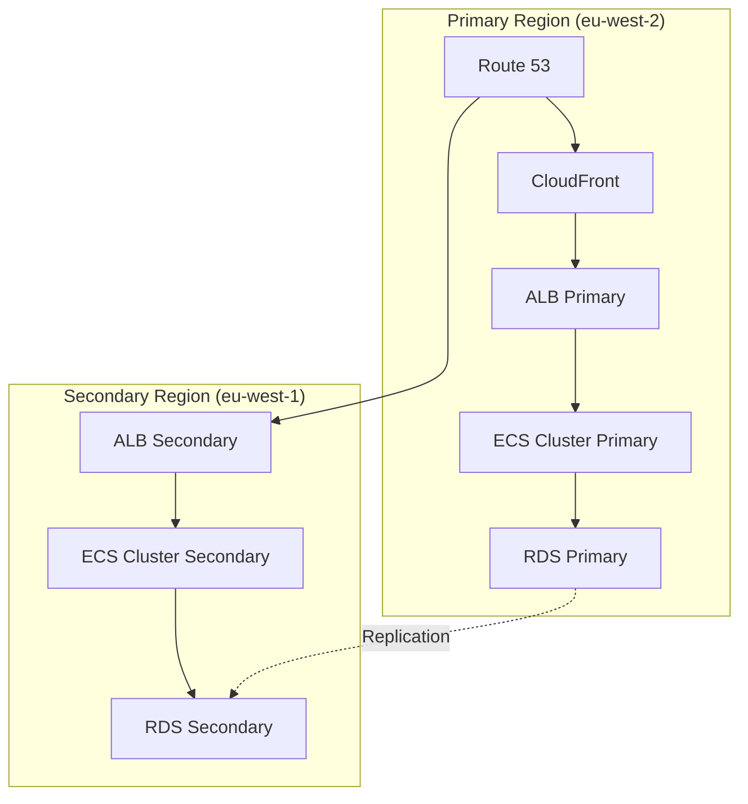

# Design Document

## Overview

This document outlines the technical design for a globally distributed tic-tac-toe gaming platform built on AWS infrastructure. The platform implements a microservices architecture with multi-region deployment, real-time gameplay capabilities, and enterprise-grade security. The design emphasizes scalability, reliability, and cost optimization while maintaining sub-100ms latency for optimal user experience.

The system serves as a modern gaming platform that can scale from hundreds to hundreds of thousands of concurrent users across multiple geographic regions, with primary deployment in eu-west-2 and disaster recovery in eu-west-1.

## Architecture

### High-Level Architecture

The platform follows a microservices architecture pattern with clear service boundaries and event-driven communication. The design implements the following key architectural principles:

- **Service Isolation**: Each service operates independently with its own data store
- **Event-Driven Communication**: Services communicate through events to maintain loose coupling
- **API-First Design**: All services expose well-defined REST APIs with OpenAPI specifications
- **Infrastructure as Code**: Complete infrastructure managed through Terraform
- **Zero-Trust Security**: No implicit trust between services or network segments

### Regional Architecture

```
Primary Region (eu-west-2):
├── Availability Zone A
│   ├── Public Subnets (ALB, NAT Gateway)
│   ├── Private Subnets (ECS Tasks, Lambda)
│   └── Isolated Subnets (RDS, ElastiCache)
├── Availability Zone B
│   ├── Public Subnets (ALB, NAT Gateway)
│   ├── Private Subnets (ECS Tasks, Lambda)
│   └── Isolated Subnets (RDS, ElastiCache)
└── Availability Zone C
    ├── Public Subnets (ALB, NAT Gateway)
    ├── Private Subnets (ECS Tasks, Lambda)
    └── Isolated Subnets (RDS, ElastiCache)

Backup Region (eu-west-1):
├── Cross-Region Replication
├── Standby Infrastructure
└── Disaster Recovery Procedures
```

### Network Design

The network architecture implements a hub-and-spoke model using AWS Transit Gateway for centralized routing and security control:

**VPC Structure:**
- Production VPC: 10.0.0.0/16
- Management VPC: 10.1.0.0/16  
- Shared Services VPC: 10.2.0.0/16

**Security Boundaries:**
- Public subnets: Internet-facing load balancers and NAT gateways
- Private subnets: Application services with no direct internet access
- Isolated subnets: Databases and sensitive services

**Traffic Flow:**
1. Internet → CloudFront → ALB → API Gateway → ECS Services
2. ECS Services → VPC Endpoints → AWS Services
3. Cross-service communication through service mesh

## Components and Interfaces

### Core Services

#### 1. Game Engine Service

**Responsibilities:**
- Game logic and move validation
- Game state management
- Match-making coordination
- Real-time game updates

**Technology Stack:**
- Runtime: ECS Fargate with Node.js
- Database: DynamoDB with DAX caching
- Communication: WebSocket API Gateway
- Scaling: Auto Scaling Groups based on CPU/memory

**API Endpoints:**
```
POST /games - Create new game
GET /games/{gameId} - Get game state
PUT /games/{gameId}/moves - Make move
DELETE /games/{gameId} - Forfeit game
WebSocket /games/{gameId}/live - Real-time updates
```

**Data Schema:**
```json
{
  "gameId": "uuid",
  "players": ["playerId1", "playerId2"],
  "board": [[null, "X", null], [null, null, "O"], [null, null, null]],
  "currentPlayer": "playerId1",
  "status": "active|completed|forfeited",
  "winner": "playerId1|playerId2|draw|null",
  "createdAt": "timestamp",
  "updatedAt": "timestamp"
}
```

#### 2. User Service

**Responsibilities:**
- User authentication and authorization
- Profile management
- Social media integration
- Session management

**Technology Stack:**
- Runtime: Lambda functions with Node.js
- Database: Aurora Global Database
- Authentication: Cognito User Pools
- Caching: ElastiCache Valkey

**API Endpoints:**
```
POST /auth/login - Social media login
POST /auth/logout - User logout
GET /users/{userId} - Get user profile
PUT /users/{userId} - Update profile
GET /users/{userId}/stats - Get user statistics
```

#### 3. Leaderboard Service

**Responsibilities:**
- Global and regional rankings
- Player statistics calculation
- Real-time leaderboard updates
- Historical data analysis

**Technology Stack:**
- Runtime: ECS Fargate with Python
- Database: Aurora Global Database with read replicas
- Caching: ElastiCache Valkey with cluster mode
- Analytics: Kinesis Data Analytics

**API Endpoints:**
```
GET /leaderboard/global - Global rankings
GET /leaderboard/regional/{region} - Regional rankings
GET /leaderboard/user/{userId} - User ranking
POST /leaderboard/update - Update player stats
```

#### 4. Support Service

**Responsibilities:**
- Ticket management
- FAQ system
- User communication
- SLA tracking

**Technology Stack:**
- Runtime: Lambda functions with Python
- Database: DynamoDB
- Queue: SQS for ticket processing
- Notifications: SNS for alerts

**API Endpoints:**
```
POST /tickets - Create support ticket
GET /tickets/{ticketId} - Get ticket details
PUT /tickets/{ticketId} - Update ticket
GET /faq - Get FAQ content
```

### Infrastructure Services

#### 1. API Gateway

**Configuration:**
- Regional API Gateway in each region
- Custom domain with Route 53 routing
- Request/response transformation
- Rate limiting and throttling
- API key management

**Rate Limiting:**
- Authenticated users: 1000 requests/minute
- Anonymous users: 100 requests/minute
- Burst capacity: 2000 requests

#### 2. Load Balancing

**Application Load Balancer:**
- Cross-zone load balancing enabled
- Health checks with custom endpoints
- SSL termination with ACM certificates
- Sticky sessions for WebSocket connections

**Target Groups:**
- Game Engine: Weighted routing
- User Service: Round-robin
- Leaderboard Service: Least outstanding requests

#### 3. Service Mesh

**AWS App Mesh Configuration:**
- Virtual services for each microservice
- Virtual routers for traffic management
- Circuit breakers and retry policies
- Distributed tracing with X-Ray

**Communication Patterns:**
- Synchronous: REST APIs for immediate responses
- Asynchronous: EventBridge for event-driven updates
- Real-time: WebSocket for live game updates

## Data Models

### Game Data Model

**Primary Storage: DynamoDB**

```
Table: Games
Partition Key: gameId
Sort Key: timestamp
Attributes:
- gameId (String)
- players (List)
- board (List)
- currentPlayer (String)
- status (String)
- winner (String)
- moves (List)
- createdAt (Number)
- updatedAt (Number)

GSI1: PlayerGames
Partition Key: playerId
Sort Key: createdAt
```

**Caching Strategy:**
- DAX for sub-millisecond reads
- Write-through caching
- TTL: 24 hours for completed games

### User Data Model

**Primary Storage: Aurora PostgreSQL**

```sql
CREATE TABLE users (
    user_id UUID PRIMARY KEY,
    email VARCHAR(255) UNIQUE NOT NULL,
    username VARCHAR(50) UNIQUE NOT NULL,
    display_name VARCHAR(100),
    avatar_url TEXT,
    social_provider VARCHAR(20),
    social_id VARCHAR(100),
    created_at TIMESTAMP DEFAULT NOW(),
    updated_at TIMESTAMP DEFAULT NOW(),
    last_login TIMESTAMP,
    is_active BOOLEAN DEFAULT TRUE
);

CREATE TABLE user_stats (
    user_id UUID REFERENCES users(user_id),
    games_played INTEGER DEFAULT 0,
    games_won INTEGER DEFAULT 0,
    games_lost INTEGER DEFAULT 0,
    games_drawn INTEGER DEFAULT 0,
    current_streak INTEGER DEFAULT 0,
    best_streak INTEGER DEFAULT 0,
    total_playtime INTERVAL DEFAULT '0',
    updated_at TIMESTAMP DEFAULT NOW()
);
```

### Leaderboard Data Model

**Materialized Views for Performance:**

```sql
CREATE MATERIALIZED VIEW global_leaderboard AS
SELECT 
    u.user_id,
    u.username,
    u.display_name,
    us.games_played,
    us.games_won,
    us.games_lost,
    CASE 
        WHEN us.games_played > 0 
        THEN ROUND((us.games_won::DECIMAL / us.games_played) * 100, 2)
        ELSE 0 
    END as win_percentage,
    us.current_streak,
    us.best_streak,
    ROW_NUMBER() OVER (ORDER BY 
        (us.games_won::DECIMAL / GREATEST(us.games_played, 1)) DESC,
        us.games_won DESC,
        us.games_played ASC
    ) as rank
FROM users u
JOIN user_stats us ON u.user_id = us.user_id
WHERE u.is_active = TRUE AND us.games_played >= 5
ORDER BY rank;
```

## Error Handling

### Error Classification

**System Errors (5xx):**
- Database connection failures
- Service unavailability
- Timeout errors
- Resource exhaustion

**Client Errors (4xx):**
- Invalid game moves
- Authentication failures
- Rate limit exceeded
- Malformed requests

### Error Response Format

```json
{
  "error": {
    "code": "INVALID_MOVE",
    "message": "The selected position is already occupied",
    "details": {
      "gameId": "123e4567-e89b-12d3-a456-426614174000",
      "position": [1, 1],
      "currentBoard": "..."
    },
    "timestamp": "2025-11-06T10:30:00Z",
    "requestId": "req-123456"
  }
}
```

### Retry Strategies

**Exponential Backoff:**
- Initial delay: 100ms
- Maximum delay: 30 seconds
- Maximum retries: 3
- Jitter: ±25%

**Circuit Breaker Pattern:**
- Failure threshold: 50% over 1 minute
- Open state duration: 30 seconds
- Half-open test requests: 3

### Graceful Degradation

**Service Degradation Levels:**
1. **Full Service**: All features available
2. **Limited Service**: Core gameplay only, leaderboards cached
3. **Emergency Mode**: Read-only access, maintenance message
4. **Maintenance Mode**: Service unavailable with ETA

## Testing Strategy

### Unit Testing

**Coverage Requirements:**
- Minimum 80% code coverage
- 100% coverage for critical game logic
- Mock external dependencies
- Test data validation and error handling

**Testing Framework:**
- Jest for Node.js services
- pytest for Python services
- Automated test execution in CI/CD

### Integration Testing

**API Testing:**
- Contract testing with Pact
- End-to-end API workflows
- Authentication flow testing
- Error scenario validation

**Database Testing:**
- Data consistency validation
- Performance benchmarking
- Backup and restore procedures
- Cross-region replication testing

### Load Testing

**Performance Benchmarks:**
- 1000 concurrent users baseline
- 10,000 concurrent users peak
- Sub-100ms API response times
- 99.99% availability target

**Testing Tools:**
- Artillery for API load testing
- WebSocket load testing for real-time features
- Database performance testing with pgbench

### Chaos Engineering

**Failure Scenarios:**
- Random service termination
- Network partition simulation
- Database failover testing
- Region failure simulation

**Automated Testing:**
- Weekly chaos experiments
- Automated rollback procedures
- Performance impact measurement
- Recovery time validation

## Security Architecture

### Zero Trust Implementation

**Network Security:**
- No direct internet access to private subnets
- VPC endpoints for AWS service communication
- Security groups with least privilege
- Network ACLs for subnet-level control

**Identity and Access:**
- IAM roles for all services
- Short-lived credentials (15 minutes)
- Service-to-service authentication via IAM
- Multi-factor authentication for admin access

### Data Protection

**Encryption:**
- At rest: AES-256 with AWS KMS
- In transit: TLS 1.3 for all communications
- Database: Transparent data encryption
- Backups: Encrypted with customer-managed keys

**Key Management:**
- Automatic key rotation every 90 days
- Separate keys per environment
- Hardware security modules (CloudHSM)
- Key usage auditing and monitoring

### Application Security

**Input Validation:**
- Server-side validation for all inputs
- SQL injection prevention
- XSS protection with CSP headers
- CSRF tokens for state-changing operations

**Rate Limiting:**
- API Gateway throttling
- Application-level rate limiting
- DDoS protection with AWS Shield
- Bot detection and mitigation

## Monitoring and Observability

### Metrics Collection

**Infrastructure Metrics:**
- CPU, memory, network utilization
- ECS task health and performance
- Database connection pools
- Load balancer response times

**Application Metrics:**
- Game completion rates
- User session duration
- API response times
- Error rates by endpoint

**Business Metrics:**
- Daily/monthly active users
- Game engagement metrics
- User retention rates
- Feature adoption rates

### Logging Strategy

**Structured Logging:**
- JSON format for all logs
- Correlation IDs for request tracing
- Log levels: ERROR, WARN, INFO, DEBUG
- Centralized logging with CloudWatch

**Log Retention:**
- Application logs: 30 days
- Audit logs: 7 years
- Performance logs: 90 days
- Security logs: 1 year

### Alerting

**Critical Alerts:**
- Service availability < 99.9%
- API response time > 1 second
- Error rate > 1%
- Database connection failures

**Warning Alerts:**
- CPU utilization > 80%
- Memory utilization > 85%
- Disk space > 90%
- Unusual traffic patterns

### Distributed Tracing

**X-Ray Implementation:**
- End-to-end request tracing
- Service dependency mapping
- Performance bottleneck identification
- Error correlation across services

## Deployment Strategy

### Infrastructure as Code

**Terraform Structure:**
```
terraform/
├── environments/
│   ├── dev/
│   ├── staging/
│   └── prod/
├── modules/
│   ├── networking/
│   ├── compute/
│   ├── database/
│   └── security/
└── shared/
    ├── variables.tf
    └── outputs.tf
```

**Environment Management:**
- Separate state files per environment
- Remote state storage in S3
- State locking with DynamoDB
- Workspace isolation

### CI/CD Pipeline

**Pipeline Stages:**
1. **Source**: Git webhook triggers
2. **Build**: Docker image creation
3. **Test**: Automated test execution
4. **Security**: Vulnerability scanning
5. **Deploy**: Blue-green deployment
6. **Validate**: Health checks and smoke tests

**Deployment Strategy:**
- Blue-green deployments for zero downtime
- Canary releases for gradual rollout
- Automated rollback on failure detection
- Feature flags for controlled feature releases

### Configuration Management

**Parameter Store:**
- Environment-specific configuration
- Feature flags and toggles
- API endpoints and service URLs
- Non-sensitive operational parameters

**Secrets Manager:**
- Database credentials
- API keys and tokens
- OAuth client secrets
- Encryption keys

## Detailed System Architecture

### Service Mesh Implementation

#### Ingress Traffic Flow



#### Service Discovery

**AWS Cloud Map Integration:**

```yaml
Service Discovery:
  Namespace: game.local
  Services:
    - Name: game-engine
      DNS: game-engine.game.local
      Health_Check:
        Protocol: HTTP
        Path: /health
        Interval: 10s
    - Name: leaderboard
      DNS: leaderboard.game.local
      Health_Check:
        Protocol: HTTP
        Path: /health
        Interval: 10s
```

**Service Mesh Routing Rules:**

```yaml
Routes:
  - Service: game-engine
    Destinations:
      - Weight: 90
        Version: v1
      - Weight: 10
        Version: v2
    Retry_Policy:
      MaxRetries: 3
      PerTryTimeout: 2s
    Circuit_Breaker:
      MaxRequests: 1000
      ConsecutiveFailures: 5
      ResetTimeout: 30s
```

### WebSocket Implementation

#### Connection Management

```python
class WebSocketManager:
    def __init__(self):
        self.connections = {}
        self.games = {}
        
    async def handle_connect(self, connection_id, user_id):
        self.connections[connection_id] = {
            'user_id': user_id,
            'game_id': None,
            'last_ping': datetime.now()
        }
        
    async def handle_game_move(self, connection_id, move_data):
        game_id = self.connections[connection_id]['game_id']
        game = self.games[game_id]
        
        if game.is_valid_move(move_data):
            await self.broadcast_game_state(game_id)
            
    async def broadcast_game_state(self, game_id):
        connections = self.get_game_connections(game_id)
        for conn in connections:
            await self.send_message(conn, game_state)
```

#### Scaling Strategy

```yaml
WebSocket Service:
  Auto_Scaling:
    Min_Capacity: 2
    Max_Capacity: 20
    Target_Metrics:
      - ConnectionCount: 1000 per instance
      - CPU_Utilization: 70%
    Scaling_Cooldown: 300s
    
  Connection_Management:
    Idle_Timeout: 600s
    Ping_Interval: 30s
    Reconnect_Window: 300s
```

### Data Pipeline Architecture

#### Real-time Game Analytics



#### Analytics Data Model

```sql
-- Real-time Aggregations Table
CREATE TABLE game_analytics (
    metric_name VARCHAR NOT NULL,
    timestamp TIMESTAMP NOT NULL,
    value DECIMAL,
    dimensions MAP<VARCHAR, VARCHAR>,
    PRIMARY KEY (metric_name, timestamp)
);

-- Materialized Analytics View
CREATE MATERIALIZED VIEW hourly_metrics AS
SELECT 
    metric_name,
    DATE_TRUNC('hour', timestamp) as hour,
    COUNT(*) as event_count,
    AVG(value) as avg_value,
    dimensions['region'] as region
FROM game_analytics
GROUP BY 
    metric_name,
    DATE_TRUNC('hour', timestamp),
    dimensions['region']
WITH DATA;
```

### Security Implementation

#### Zero Trust Network Architecture

```yaml
Network_Segments:
  Public_Tier:
    - ALB
    - NAT Gateway
    - Bastion Host
    
  Application_Tier:
    - ECS Tasks
    - Lambda Functions
      
  Data_Tier:
    - RDS
    - ElastiCache
    - DynamoDB VPC Endpoint

Security_Controls:
  Public_To_App:
    Ingress:
      - HTTPS (443)
    Egress:
      - Response Traffic
        
  App_To_Data:
    Ingress:
      - Database Ports
      - Cache Ports
    Egress:
      - None

VPC_Endpoints:
  Interface:
    - ecr.api
    - ecr.dkr
    - logs
    - secretsmanager
  Gateway:
    - s3
    - dynamodb
```

#### IAM Policies

```json
{
  "Version": "2012-10-17",
  "Statement": [
    {
      "Sid": "GameEngineServicePolicy",
      "Effect": "Allow",
      "Action": [
        "dynamodb:GetItem",
        "dynamodb:PutItem",
        "dynamodb:UpdateItem",
        "dynamodb:Query"
      ],
      "Resource": [
        "arn:aws:dynamodb:${region}:${account}:table/games",
        "arn:aws:dynamodb:${region}:${account}:table/games/index/*"
      ],
      "Condition": {
        "StringEquals": {
          "aws:PrincipalTag/Service": "game-engine"
        }
      }
    }
  ]
}
```

## Comprehensive Monitoring & Observability

### Metric Collection and Alerting

#### Custom Metrics

```python
import boto3
cloudwatch = boto3.client('cloudwatch')

def publish_game_metrics(game_id, duration, moves):
    cloudwatch.put_metric_data(
        Namespace='TicTacToe/GameMetrics',
        MetricData=[
            {
                'MetricName': 'GameDuration',
                'Dimensions': [
                    {'Name': 'GameId', 'Value': game_id}
                ],
                'Value': duration,
                'Unit': 'Seconds'
            },
            {
                'MetricName': 'MovesCount',
                'Dimensions': [
                    {'Name': 'GameId', 'Value': game_id}
                ],
                'Value': moves,
                'Unit': 'Count'
            }
        ]
    )
```

#### Alerting Configuration

```yaml
Alarms:
  High_Error_Rate:
    Metric: ErrorRate
    Threshold: 1%
    Period: 5 minutes
    EvaluationPeriods: 3
    Actions:
      - SNS_Topic: urgent-alerts
      - Lambda: auto-scale-up

  API_Latency:
    Metric: P95Latency
    Threshold: 200ms
    Period: 1 minute
    EvaluationPeriods: 5
    Actions:
      - SNS_Topic: performance-alerts
      - Lambda: latency-diagnosis

  Database_Connections:
    Metric: DatabaseConnectionCount
    Threshold: 80%
    Period: 1 minute
    EvaluationPeriods: 3
    Actions:
      - SNS_Topic: database-alerts
      - Lambda: connection-pool-expand
```

### Log Analysis

#### Log Aggregation Pipeline



#### Log Query Examples

```sql
-- Error Rate Analysis
fields @timestamp, @message
| filter @message like /ERROR/
| stats count(*) as error_count by bin(5m)
| sort by @timestamp desc

-- Slow API Requests
fields @timestamp, @message
| filter @message like /API request/
| parse @message "duration: * ms" as duration
| filter duration > 1000
| stats count(*) as slow_requests, avg(duration) as avg_duration by apiName
| sort by slow_requests desc
```

### Distributed Tracing

#### X-Ray Configuration

```yaml
X-Ray_Daemon:
  ECS_Task_Definition:
    Image: amazon/aws-xray-daemon
    CPU: 32
    Memory: 256
    Port_Mappings:
      - ContainerPort: 2000
        Protocol: udp

Tracing:
  Sampling_Rules:
    - RuleName: Default
      Priority: 10000
      FixedRate: 0.05
      ReservoirSize: 1
      ServiceName: "*"
      HTTPMethod: "*"
      URLPath: "*"
      ResourceARN: "*"
  Custom_Rules:
    - RuleName: GameEngine
      Priority: 100
      FixedRate: 1
      ServiceName: game-engine
      HTTPMethod: POST
      URLPath: "/api/games/*/moves"
```

#### Trace Analysis

```python
import boto3
xray_client = boto3.client('xray')

def analyze_traces():
    response = xray_client.get_trace_summaries(
        StartTime=start_time,
        EndTime=end_time,
        Sampling=False,
        FilterExpression="service(id(name: \"game-engine\"))"
    )
    
    for trace in response['TraceSummaries']:
        trace_details = xray_client.batch_get_traces(
            TraceIds=[trace['Id']]
        )
        analyze_trace_segments(trace_details['Traces'])

def analyze_trace_segments(trace):
    # Custom logic to analyze trace segments
    pass
```

## Comprehensive Disaster Recovery

### Multi-Region Failover Architecture

#### Active-Passive Configuration



#### Failover Procedure

```yaml
Failover_Steps:
  1_Detect_Failure:
    - CloudWatch Alarms on critical services
    - Route 53 health checks on ALB
    
  2_Initiate_Failover:
    - Lambda triggered by CloudWatch Alarm
    - Update Route 53 routing policy
    
  3_Promote_Secondary:
    - Promote RDS secondary to primary
    - Scale up ECS tasks in secondary region
    
  4_Verify_Failover:
    - Run automated tests against new primary
    - Verify data consistency
    
  5_Notify_Stakeholders:
    - SNS notifications to operations team
    - Update status page for users

Recovery_Time_Objective: 15 minutes
Recovery_Point_Objective: 5 minutes
```

### Data Recovery Strategies

#### Backup and Restore

```yaml
Backup_Strategy:
  RDS:
    Type: Automated backups
    Frequency: Daily
    Retention: 35 days
    Encryption: AES-256

  DynamoDB:
    Type: Continuous backups
    Point-in-time Recovery: Enabled
    Retention: 35 days

  EFS:
    Type: AWS Backup
    Frequency: Daily
    Retention: 90 days

Restore_Procedures:
  RDS:
    - Initiate restore from latest snapshot
    - Apply transaction logs to reach desired point-in-time
    - Verify data integrity
    - Update application configuration

  DynamoDB:
    - Initiate point-in-time recovery
    - Verify table schema and GSIs
    - Run consistency check on restored data

  EFS:
    - Mount restored EFS to test EC2 instance
    - Verify file integrity and permissions
    - Update EFS mount targets in production
```

## Advanced Deployment Strategies

### Blue-Green Deployment

#### ECS Blue-Green with CodeDeploy

```yaml
CodeDeploy:
  Application: tic-tac-toe
  DeploymentGroup: game-engine
  DeploymentConfig:
    Type: BLUE_GREEN
    TrafficRouting:
      Type: AllAtOnce
    BlueGreenDeploymentConfig:
      TerminationWaitTime: 1 hour
      DeploymentReadyOption:
        ActionOnTimeout: STOP_DEPLOYMENT
        WaitTime: 10 minutes
      GreenFleetProvisioningOption:
        Action: COPY_AUTO_SCALING_GROUP

ECS:
  TaskDefinition: game-engine
  Service: game-engine-service
  Cluster: game-cluster
  AutoRollbackConfiguration:
    Enabled: true
    Events:
      - DEPLOYMENT_FAILURE
      - DEPLOYMENT_STOP_ON_ALARM
```

### Canary Releases

#### API Gateway Canary Deployment

```yaml
API_Gateway:
  Stage: production
  Deployment:
    CanarySettings:
      PercentTraffic: 10
      StageVariableOverrides:
        CacheClusterEnabled: 'false'
      UseStageCache: false

  Canary_Analysis:
    Duration: 1 hour
    Metric_Alarms:
      - 5XXError_Rate:
          Threshold: 1%
          EvaluationPeriods: 5
      - 4XXError_Rate:
          Threshold: 5%
          EvaluationPeriods: 5
      - Latency_P95:
          Threshold: 500ms
          EvaluationPeriods: 10

  Auto_Rollback:
    Enabled: true
    Triggers:
      - ALARM_TRIGGERED
      - DEPLOYMENT_FAILURE
```

## Performance Optimization

### Database Query Optimization

#### Aurora Performance Insights

```sql
-- Identify slow queries
SELECT 
    queryid, 
    query, 
    mean_exec_time, 
    calls
FROM pg_stat_statements
ORDER BY mean_exec_time DESC
LIMIT 10;

-- Analyze and optimize
EXPLAIN ANALYZE
SELECT * FROM games
WHERE player_id = 'abc123'
  AND status = 'active'
ORDER BY created_at DESC
LIMIT 10;

-- Add index to improve performance
CREATE INDEX idx_player_status_created
ON games (player_id, status, created_at DESC);
```

### Caching Strategies

#### Multi-Tier Caching

```yaml
Caching_Layers:
  CDN_Cache:
    Service: CloudFront
    TTL:
      Default: 300s
      Minimum: 0s
      Maximum: 1200s

  API_Cache:
    Service: API Gateway
    TTL: 60s
    Encryption: true
    Size: 0.5GB

  Application_Cache:
    Service: ElastiCache Valkey
    Engine_Version: 7.x
    Node_Type: cache.m5.large
    Num_Shards: 3
    Replicas_Per_Shard: 1

  Database_Cache:
    Service: DAX (DynamoDB Accelerator)
    Node_Type: dax.r4.large
    Nodes: 3
    TTL: 300s
```

## Cost Management

### Resource Optimization

#### EC2 Right-Sizing

```python
import boto3
ec2 = boto3.client('ec2')
cloudwatch = boto3.client('cloudwatch')

def analyze_instance_usage(instance_id):
    cpu_util = cloudwatch.get_metric_statistics(
        Namespace='AWS/EC2',
        MetricName='CPUUtilization',
        Dimensions=[{'Name': 'InstanceId', 'Value': instance_id}],
        StartTime=start_time,
        EndTime=end_time,
        Period=3600,
        Statistics=['Average']
    )
    
    if cpu_util['Datapoints'][0]['Average'] < 30:
        recommend_downsize(instance_id)

def recommend_downsize(instance_id):
    instance = ec2.describe_instances(InstanceIds=[instance_id])
    current_type = instance['Reservations'][0]['Instances'][0]['InstanceType']
    
    # Logic to recommend smaller instance type
    recommended_type = get_recommended_type(current_type)
    
    print(f"Instance {instance_id} of type {current_type} is underutilized. Consider downsizing to {recommended_type}.")
```

### Cost Allocation

#### Tagging Strategy

```yaml
Mandatory_Tags:
  - Key: Environment
    Values: [dev, staging, prod]
  - Key: Project
    Values: [tic-tac-toe, auth-service, analytics]
  - Key: CostCenter
    Values: [marketing, engineering, operations]

AWS_Config:
  Rule: required-tags
  Parameters:
    tag1Key: Environment
    tag2Key: Project
    tag3Key: CostCenter

Cost_Explorer:
  Reports:
    - Name: Monthly_Cost_By_Project
      GroupBy:
        - Type: TAG
          Key: Project
      Granularity: MONTHLY
    
    - Name: Daily_Cost_By_Environment
      GroupBy:
        - Type: TAG
          Key: Environment
      Granularity: DAILY
```

## Operational Procedures

### Incident Response

#### Runbook: Game Engine High Error Rate

```yaml
Incident_Type: Game Engine High Error Rate
Severity: Critical
Response_Team: Game Engine On-Call

Detection:
  - CloudWatch Alarm: GameEngine5xxErrors > 1% for 5 minutes

Initial_Assessment:
  1. Check Game Engine ECS service health
  2. Verify recent deployments or configuration changes
  3. Analyze error logs in CloudWatch Logs

Mitigation_Steps:
  1. Scale up ECS service:
     aws ecs update-service --cluster game-cluster --service game-engine --desired-count 4

  2. If recent deployment, initiate rollback:
     aws deploy rollback --deployment-id <DEPLOYMENT_ID>

  3. Check DynamoDB throttling:
     aws cloudwatch get-metric-statistics --namespace AWS/DynamoDB --metric-name ThrottledRequests

  4. Increase DynamoDB provisioned capacity if needed:
     aws dynamodb update-table --table-name games --provisioned-throughput ReadCapacityUnits=1000,WriteCapacityUnits=1000

Resolution:
  1. Confirm error rate has dropped below threshold
  2. Analyze root cause using X-Ray traces and CloudWatch Logs
  3. Create post-mortem report and update runbook if necessary

Communication:
  - Update status page: https://status.tic-tac-toe-game.com
  - Send incident report to stakeholders via SNS topic: arn:aws:sns:eu-west-2:123456789012:critical-incidents
```

### Routine Maintenance

#### Monthly Security Patching

```yaml
Maintenance_Window:
  Schedule: First Sunday of every month, 02:00 AM UTC
  Duration: 4 hours
  Allowed_Services:
    - Amazon ECS
    - Amazon RDS
    - Amazon ElastiCache

Pre_Patching_Checks:
  1. Verify backup completion for all databases
  2. Ensure all CI/CD pipelines are in a stable state
  3. Check for any scheduled marketing events or high-traffic periods

Patching_Procedure:
  ECS:
    1. Update ECS AMI to latest version
    2. Perform rolling update of ECS cluster
    
  RDS:
    1. Apply pending patches to staging environment
    2. Run automated tests against staging
    3. Schedule production update with 15-minute failover window
    
  ElastiCache:
    1. Create manual snapshot of each cache cluster
    2. Apply service updates to non-primary nodes
    3. Failover to patched nodes
    
Post_Patching_Verification:
  1. Run full suite of integration tests
  2. Verify application performance metrics
  3. Confirm successful replication for all data stores
  4. Update patching status in CMDB

Rollback_Plan:
  1. Revert to pre-patching AMI for ECS
  2. Restore RDS from pre-patching snapshot
  3. Rebuild ElastiCache cluster from backup if issues persist
```

This comprehensive design document now covers all major aspects of the tic-tac-toe gaming platform, including detailed architectures, implementation strategies, operational procedures, and optimization techniques. It provides a solid foundation for building a scalable, reliable, and efficient cloud-native application on AWS.